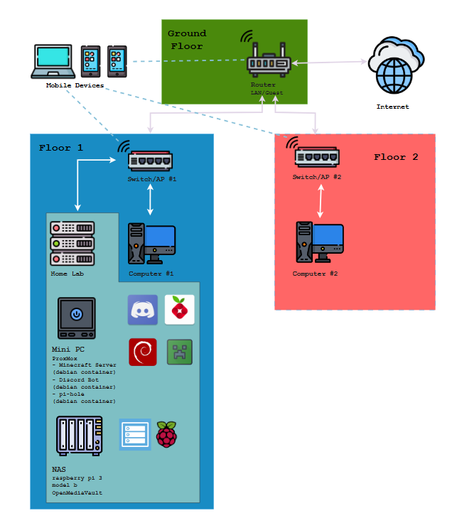

# Home Network & Homelab

A quick overview of my home network setup and the homelab services running on it.

## Overview

This repo documents the layout of my home network — from ISP to endpoint devices — along with the self-hosted services running in my homelab. It's mostly for my own reference, but also as a way to track how the setup evolves over time.

## Network Diagram

## Topology

- **Internet** connects into a single **Router**, which handles both the main **LAN** and a separate **Guest** network.
- The router broadcasts Wi-Fi directly for **mobile devices**.
- Two downstream **Switch/AP** units extend wired and wireless connectivity to different parts of the house:
  - **Switch/AP #1** — serves WiFi to the first floor, Computer #1 - representative of all wired hardware on the first floor - and the **Home Lab** rack (wired).
  - **Switch/AP #2** — serves WiFi to the second floor and Computer #2 - representative of all wired hardware on the second floor.

## Hardware

| Device | Role | Notes |
|---|---|---|
| Router | Gateway / DHCP / Wi-Fi | Handles LAN + Guest networks |
| Switch/AP (x2) | Wired switching + Wi-Fi extension | |
| Mini PC | Homelab hypervisor | Running Proxmox VE |
| Raspberry Pi 3 Model B | NAS | Running OpenMediaVault |
| Computer 1 / Computer 2 | Desktops | Wired clients |
| Mobile Devices | Phones/tablets/laptops | Wi-Fi clients |

## Home Lab Services

Running on the **Mini PC (Proxmox)**, each service in its own Debian LXC container:

| Service | Container | Purpose |
|---|---|---|
| Minecraft Server | Debian LXC | Self-hosted game server |
| Discord Bot | Debian LXC | Custom bot for Discord |
| Pi-hole | Debian LXC | Network-wide ad/tracker blocking (DNS) |

**Raspberry Pi 3 Model B** runs **OpenMediaVault**, acting as the NAS for file storage/backups.

## Future Improvements

- [ ] Add VLAN segmentation (e.g. separate IoT/guest traffic from trusted devices)
- [ ] Add reverse proxy (e.g. Nginx Proxy Manager / Traefik) for internal services
- [ ] Set up centralized monitoring (e.g. Grafana + Prometheus, or Uptime Kuma)
- [ ] Automate container backups
- [ ] create a container that hosts navidrome
- [ ] link together my devices and home lab using tailscale
- [ ] Consider UPS for the homelab rack

## Notes

This is a living document — hardware and services will change as the homelab grows.
